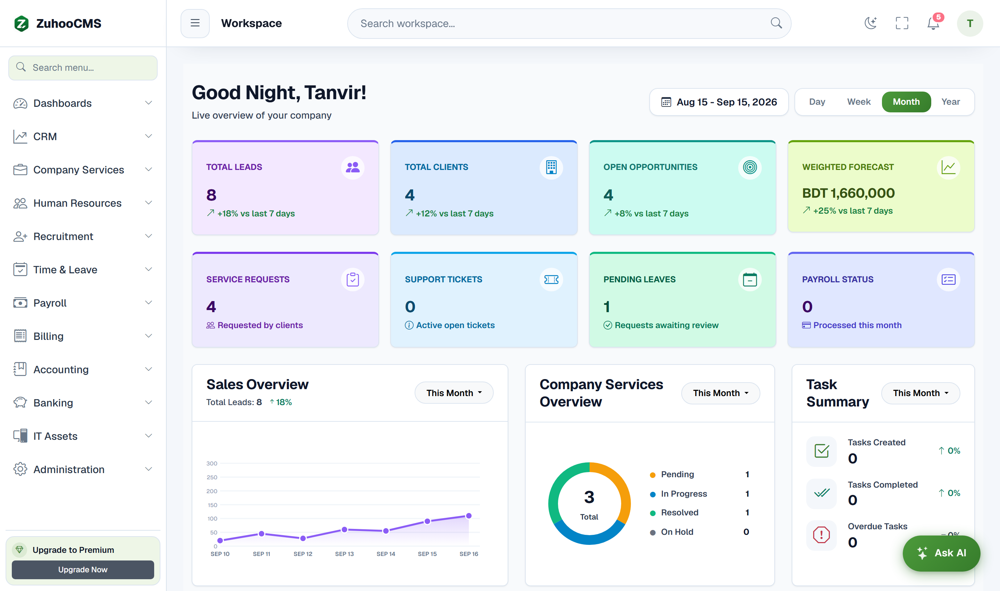
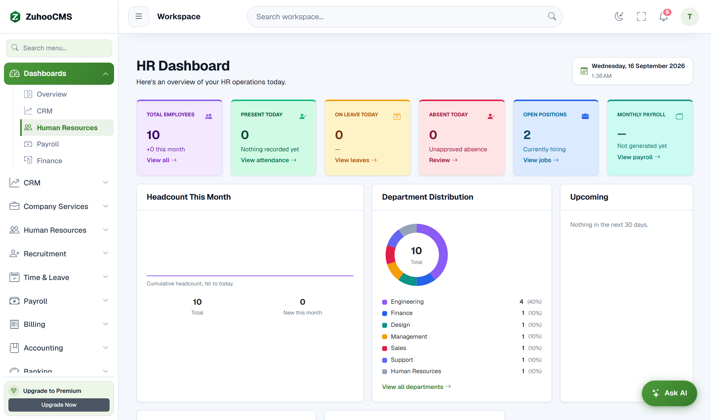
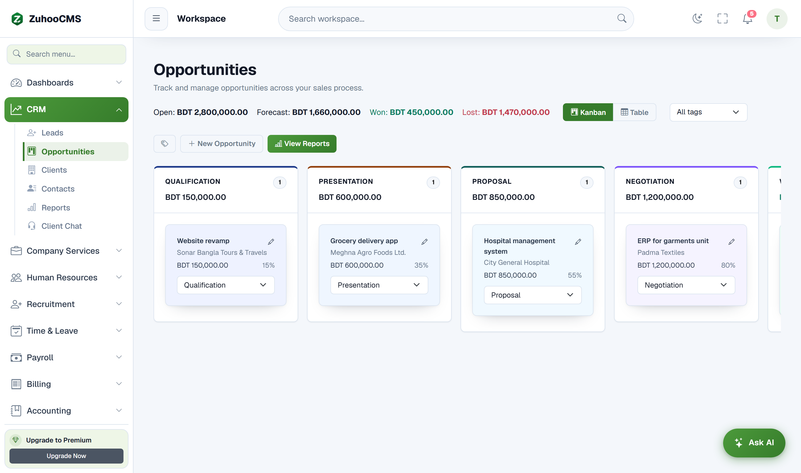
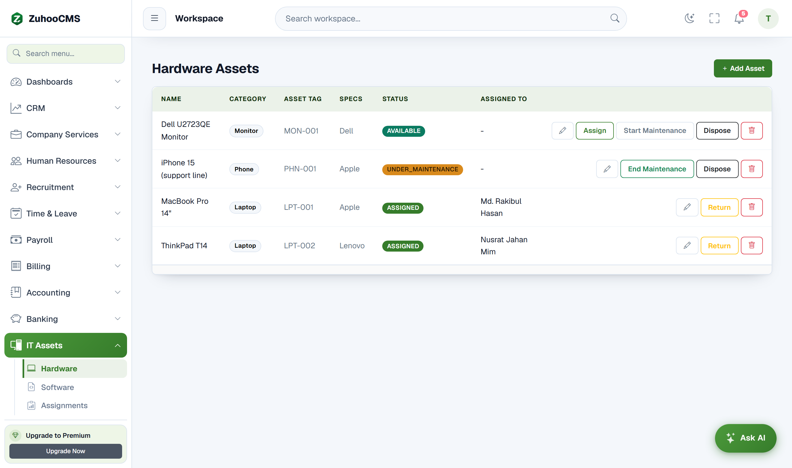
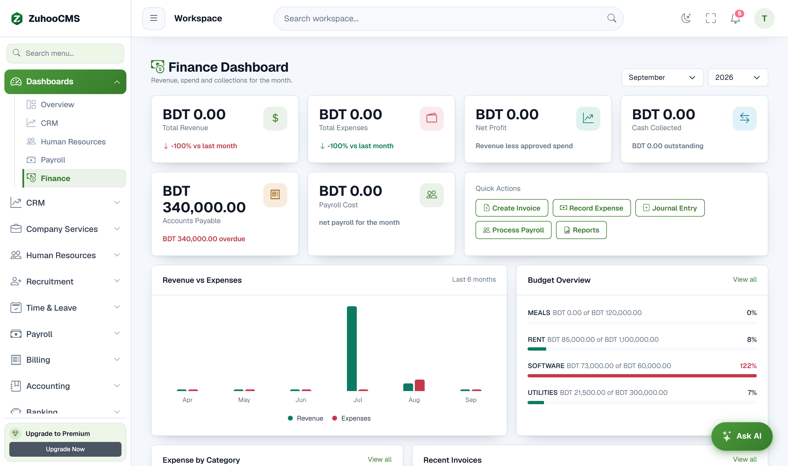
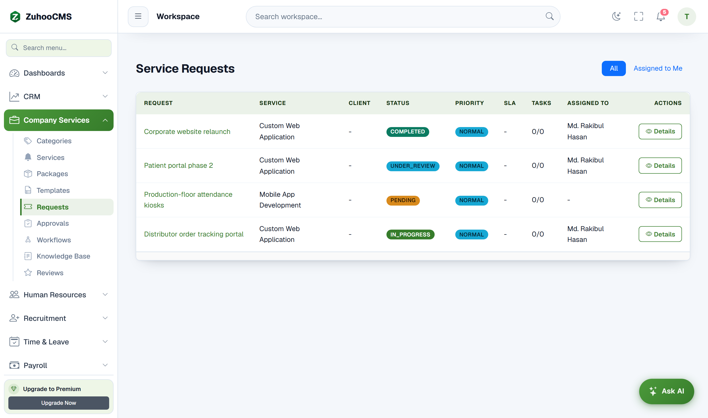
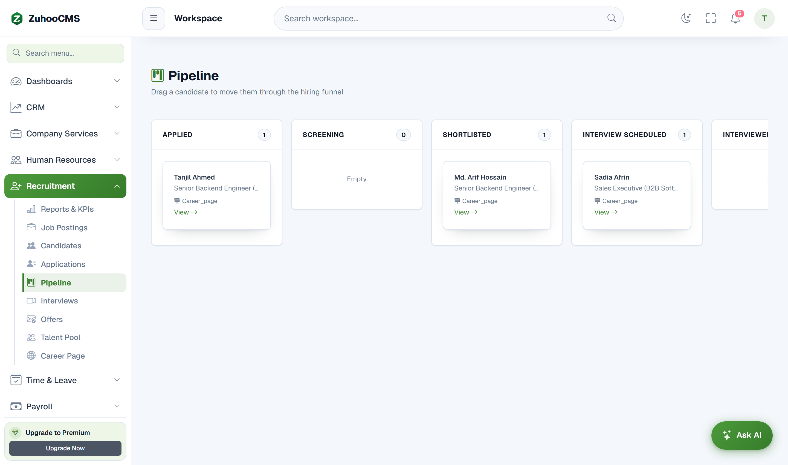

<div align="center">

<picture>
  <source media="(prefers-color-scheme: dark)" srcset="document/logo/darklogo.png">
  
</picture>

### Smart • Simple • Secure

**A multi-tenant business management platform with HRM, CRM, Finance, IT Assets, Service Desk and Support in one system, available on web, Android and Flutter.**


</div>

---

## About

ZuhooCMS is an all-in-one SaaS platform for small and mid-sized companies. A company registers, picks a subscription plan and invites its team. From then on, HR, sales, accounting, IT assets and customer support all run in one place, with role-based access for employees, managers, clients and platform admins.

It is a **solo project**: I designed the database, built the backend, and wrote all three clients (web, Flutter and native Android).

### By the numbers

| | |
|---|---|
| Business modules | **12** |
| REST endpoints | **750+** |
| Database entities | **137** |
| Angular components | **197** |
| Flutter feature areas | **38** |
| Total code | **~250,000 lines** (Java, TypeScript/HTML, Dart) |


## Screenshots


| Dashboard | HRM: Attendance | CRM Pipeline | IT Asset |
|---|---|---|---|
|  |  |  |  |

| Finance | Service Desk | Recruitment |
|---|---|---|---|
|  |  | |

---
## Modules

| Module | What it covers |
|---|---|
| **HRM** | Employees, departments, designations, attendance (incl. biometric devices), shifts, timesheets, holidays, leave policies & balances, payroll & salary structures, loans, performance reviews, announcements |
| **Recruitment** | Job postings, candidates, applications, talent pool, employee referrals, public careers page |
| **CRM** | Leads, contacts, clients, opportunities/deal pipeline, activities, tags, duplicate detection, lead capture |
| **Finance** | Chart of accounts, general ledger, journal entries, invoices, payments, expenses, vendors, budgets, fixed assets, bank reconciliation, accounting periods, financial reports |
| **IT Asset Management** | Hardware & software assets, bulk asset import, employee offboarding (asset recovery) |
| **Service Desk** | Service catalogue & templates, service requests, dynamic forms, approval workflows, tasks, proposals, billing, knowledge base, reviews |
| **Support** | Tickets, agents, categories, SLAs, messaging, audit trail |
| **AI Assistant** | Chat assistant that works with **Gemini, OpenAI, Claude and Groq** and can take real actions through 18 tools, such as applying for leave, checking in, logging a timesheet, submitting an expense or referring a candidate. Includes rate limits, encrypted per-company API keys and audit logs |
| **Dashboards & Search** | Role-based dashboards with charts, insights and recommendations, plus global search |
| **Company & Subscriptions** | Company registration, team invites, custom roles & permissions, subscription plans with enforcement |
| **Website / Portal** | Configurable public website (pages, pricing, FAQ, team), client portal |
| **Demo Mode** | One-click demo sessions with seeded data and read-only protection |

---

## Tech Stack

**Backend**: Java 21, Spring Boot 4.1
- Spring Web, Spring Data JPA (Hibernate), PostgreSQL
- Spring Security with **JWT** authentication, multi-tenant data isolation, subscription enforcement filter
- WebSocket / STOMP for real-time notifications, **Firebase Cloud Messaging** for push
- Spring Mail, scheduled jobs (`@Scheduled`), Bean Validation
- Apache POI (Excel import/export), OpenHTMLtoPDF + PDFBox (PDF reports)
- springdoc-openapi (Swagger UI)
- Payment gateway integrations: bKash, Nagad, Rocket

**Web Frontend**: Angular 22, TypeScript
- Bootstrap 5, Bootstrap Icons, Chart.js (ng2-charts)
- STOMP.js for live updates

**Mobile (Flutter)**: Dart
- Riverpod (state), GoRouter (navigation), Dio (HTTP)
- Firebase Messaging + local notifications, secure storage
- Geolocation check-in, image/file pickers, speech-to-text

**Mobile (Native Android)**: Java, Retrofit, min SDK 26 / target SDK 36


**Microservices (in progress)**: moving to microservices in the `SAAS-ZuhooCMS` repo with Spring Cloud Gateway, splitting out Identity, HRM, Payroll and Notification services, each with its own schema managed by Flyway.

---

## Architecture

```
 ┌───────────────┐   ┌───────────────┐   ┌────────────────┐
 │  Angular Web  │   │  Flutter App  │   │ Android (Java) │
 └───────┬───────┘   └───────┬───────┘   └───────┬────────┘
         │    REST (JWT)  +  WebSocket/STOMP     │
         └───────────────────┼───────────────────┘
                             ▼
              ┌──────────────────────────────┐
              │   Spring Boot API (:8085)    │
              │  Security → Controller →     │
              │  Service → Repository        │
              └──────┬─────────────┬─────────┘
                     │             │
              ┌──────▼─────┐  ┌────▼───────────────────────┐
              │ PostgreSQL │  │ Firebase · Mail · AI APIs  │
              └────────────┘  │ Payment gateways           │
                              └────────────────────────────┘

```

Each business module follows the same layered structure (`Controller → Service → ServiceImpl → Repository`, with DTOs and mappers), under `com.zuhoocms.modules.<module>`.

---

## Project Structure

```
Project_ZuhooCMS/
├── Spring-boot/ZuhooCMS/   # REST API (Java 21, Spring Boot)
│   └── src/main/java/com/zuhoocms/
│       ├── auth/  security/  config/  core/  shared/  enums/
│       └── modules/  ai · company · crm · dashboard · demo · finance
│                     hrm · itam · search · servicedesk · support · website
├── Angular/ZuhooCMS/       # Web app (Angular 22)
├── Flutter/zuhoo/          # Cross-platform mobile app
├── Android/ZuhooCMS/       # Native Android app
└── document/               # Logos and docs
```

---

## Getting Started

### Prerequisites
- JDK 21
- PostgreSQL 15+
- Node.js 20+ and npm
- Flutter SDK (Dart 3.12+)
- Android Studio (for the native app)

### 1. Backend

```bash
# Create the database
createdb businessflow
```

Create `Spring-boot/ZuhooCMS/src/main/resources/application-local.properties` (it is gitignored):

```properties
spring.datasource.url=jdbc:postgresql://localhost:5432/businessflow
spring.datasource.username=postgres
spring.datasource.password=your_password
app.frontend-url=http://localhost:4200
```

Set the environment variables you need. Only `JWT_SECRET` is required for a basic run:

| Variable | Purpose |
|---|---|
| `JWT_SECRET` | Signing key for access tokens |
| `MAIL_USERNAME`, `MAIL_PASSWORD` | Outgoing email |
| `FIREBASE_CREDENTIALS_PATH` | Push notifications |
| `GEMINI_API_KEY`, `OPENAI_API_KEY`, `CLAUDE_API_KEY`, `GROQ_API_KEY` | AI assistant providers |
| `AI_KEY_ENCRYPTION_SECRET` | Encrypts per-company AI keys |
| `BKASH_*`, `NAGAD_*`, `ROCKET_*` | Payment gateways (optional) |


```bash
cd Spring-boot/ZuhooCMS
./mvnw spring-boot:run
```

- API: http://localhost:8085/api
- Swagger UI: http://localhost:8085/swagger-ui.html

### 2. Web app

```bash
cd Angular/ZuhooCMS
npm install
npm start
```

Open http://localhost:4200
### 3. Flutter app

```bash
cd Flutter/zuhoo
flutter pub get
flutter run
```

The Android emulator reaches the backend at `http://10.0.2.2:8085`. On a physical device, use your machine's LAN IP instead.

### 4. Native Android app
Open `Android/ZuhooCMS` in Android Studio and run it on an emulator or device.

---

## Key Features at a Glance

-  **JWT auth** with custom roles and fine-grained permissions
-  **Multi-tenant**: every company's data is isolated
-  **Attendance** from biometric devices, GPS check-in on mobile, shifts and timesheets
-  **Payroll** with salary structures, components, loans and salary sheets
-  **Double-entry accounting** with ledger, journals, reconciliation and reports
-  **AI assistant** that can take actions, not just answer questions
-  **Real-time** in-app notifications (WebSocket) and mobile push (FCM)
-  **Excel & PDF** import/export and reports
-  **Public careers page and company website** built in

---

## Roadmap

- [x] Monolith with 12 modules across web, Flutter and Android
- [ ] Microservices: API Gateway, Identity, HRM, Payroll, Notification _(in progress)_
- [ ] Split CRM, Finance and Service Desk into services
- [ ] Docker / CI pipeline
- [ ] Live demo deployment

---

## Author

**Rehana Rafiaah**, Full Stack Developer (Java · Spring Boot · Angular · Android · Flutter)

[](https://www.linkedin.com/in/raf-rehana/)
[](https://github.com/rafiaahrehana)

Built during the **IsDB-BISEW IT Scholarship Programme**.
